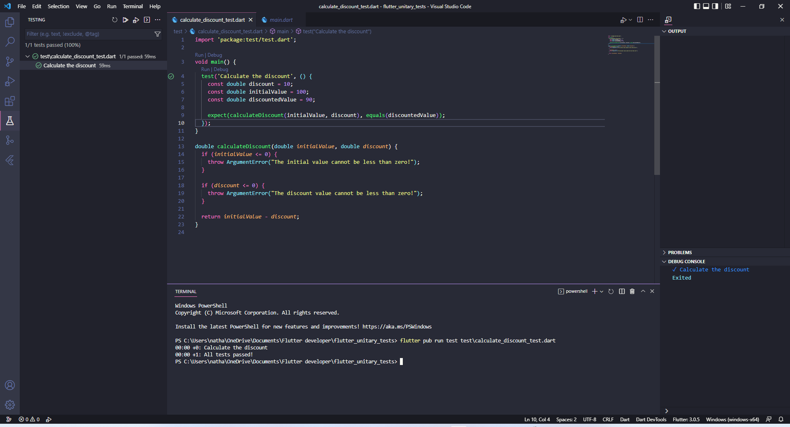

# flutter_unitary_tests

# Test
### test provides a standard way of writing and running tests in Dart.
### Tests are specified using the top-level test() function, and test assertions are made using expect()

### Use this package as a library. Depend on it. Run this command:

With Dart:

 `$ dart pub add test --dev`

With Flutter:

 `$ flutter pub add test --dev`

